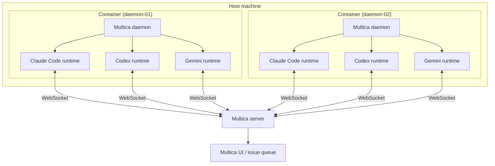

# Multica Daemon — Containerized Runtimes

Docker images that bundle the [Multica](https://multica.ai) daemon together with one or more AI coding agent CLIs (Claude Code, Codex, Copilot, Gemini, OpenCode, Pi, …). Run them anywhere Docker runs to spin up scalable, isolated [Multica runtimes](https://multica.ai/docs/daemon-runtimes) without polluting your host machine.

> A **runtime** in Multica is the combination of *daemon × one AI coding tool*. This repo packages that combination into reproducible container images so you can scale runtimes horizontally — locally with Docker Compose, on a server, or on Kubernetes — instead of installing every CLI on every developer's laptop.

## Architecture



One host runs **N containers** (one per `MULTICA_DAEMON_ID`). Each container runs **M runtimes** (one per installed CLI × workspace). Total runtimes on that host: **N × M**.

## What's in the box

Each image contains:

- **Node.js 24** (Debian Trixie slim base) — needed by most CLIs, which are distributed as npm packages
- **The Multica CLI / daemon** — installed from the official `install.sh`
- **Pinned versions of the AI coding agent CLIs** (see [`Dockerfile`](./Dockerfile) for the exact `*_VERSION` build args):
  - `@anthropic-ai/claude-code` — Claude Code
  - `@openai/codex` — Codex
  - `@github/copilot` — GitHub Copilot CLI
  - `@google/gemini-cli` — Gemini
  - `opencode-ai` — OpenCode
  - `@earendil-works/pi-coding-agent` — Pi
- **An entrypoint** ([`src/docker-entrypoint.sh`](./src/docker-entrypoint.sh)) that:
  1. Configures the daemon (`server_url`, `app_url`, `device_name`)
  2. Logs in with `MULTICA_TOKEN`
  3. Starts `multica daemon start --foreground` as PID 1

The container runs as a non-root `multica` user with `HOME=/multica` and a workspace root at `/workspaces` (override with `MULTICA_WORKSPACES_ROOT`).

## Quick start (Docker Compose)

1. **Get a runtime installer token** from the Multica UI (Settings → Runtimes → *Install a runtime*). It looks like `mul_…`.

2. **Create your `.env`** by copying the example and filling in the token:

   ```bash
   cp .env.example .env
   $EDITOR .env
   ```

   Minimum required variables:

   | Variable | Description |
   | --- | --- |
   | `MULTICA_APP_URL` | URL of the Multica web app (e.g. `https://app.multica.ai`) |
   | `MULTICA_SERVER_URL` | URL of the Multica API/WebSocket server |
   | `MULTICA_TOKEN` | Runtime installer token (`mul_…`) |
   | `MULTICA_DAEMON_ID` | A unique name for this daemon (shown in the Runtimes page) |

3. **Start the runtime:**

   ```bash
   docker compose up -d
   docker compose logs -f runtime
   ```

4. **Verify** — open the **Runtimes** page in the Multica UI. You should see one row per enabled CLI for this daemon, all marked *online*. From here you can assign issues/tasks and they will be picked up by this container.

To stop the runtime:

```bash
docker compose down
```

## Quick start (plain Docker)

```bash
docker build -t multica-runtime:dev .

docker run -d \
  --name multica-runtime \
  -e MULTICA_APP_URL=https://app.multica.ai \
  -e MULTICA_SERVER_URL=https://api.multica.ai \
  -e MULTICA_TOKEN=mul_xxxxxxxxxxxxxxxxxxxxxxxxxxxxxxxxxxxxxxxx \
  -e MULTICA_DAEMON_ID=daemon-01 \
  multica-runtime:dev
```

## How runtimes scale

A single host can run any number of daemon containers simultaneously. Each container registers its own set of runtimes with the Multica server.

```
1 host
└── N containers  (one MULTICA_DAEMON_ID each, e.g. daemon-01 … daemon-N)
    └── M runtimes per container  (one per installed CLI × workspace)
        └── Total = N × M runtimes visible in the Multica UI
```

**Example:** three containers on one server, each with the all-in-one image (6 CLIs), connected to 1 workspace → **3 × 6 × 1 = 18 runtimes**.

Practical scaling guidelines:

- **Scale containers** (`N`) when you want more parallel capacity for the same set of CLIs — each container handles tasks independently.
- **Scale using variants** (`M`) when you need specific CLIs per container, e.g. run only the `claude` variant to dedicate hardware to Claude Code tasks.
- **`MULTICA_DAEMON_MAX_CONCURRENT_TASKS`** caps how many tasks one daemon runs at once (default: 20). Lower it if your host is CPU/memory constrained.
- **Do not** run two containers with the same `MULTICA_DAEMON_ID` — the server will see conflicting heartbeats and reclaim tasks unpredictably.

## Configuration reference

### Multica daemon

| Variable | Default | Description |
| --- | --- | --- |
| `MULTICA_APP_URL` | — (required) | URL of the Multica web app |
| `MULTICA_SERVER_URL` | — (required) | URL of the Multica server (API / WebSocket) |
| `MULTICA_TOKEN` | — (required) | Runtime installer token |
| `MULTICA_DAEMON_ID` | — (required) | Daemon device name, shown on the Runtimes page |
| `MULTICA_WORKSPACES_ROOT` | `/workspaces` | Where the daemon clones repositories |
| `MULTICA_DAEMON_MAX_CONCURRENT_TASKS` | `20` (Multica default) | Per-daemon concurrent task limit |

### Installed CLIs

Each CLI installed in the image is exposed to the daemon by default. Use an image variant when you want to run only one bundled CLI.

> Each installed CLI shows up as its own runtime row in the Multica UI (one per *daemon × tool × workspace* combination).

### Per-CLI credentials

The Multica daemon does **not** ship the credentials each AI CLI needs. You must provide them yourself. The table below lists every bundled CLI, where to obtain its credential, and how to pass it to the container.

| CLI | Credential | Where to get it | Env var | Mount path |
| --- | --- | --- | --- | --- |
| **Claude Code** | Anthropic API key | [console.anthropic.com](https://console.anthropic.com) → API Keys | `ANTHROPIC_API_KEY` | `~/.config/anthropic` inside `/multica` |
| **Codex** | OpenAI API key | [platform.openai.com](https://platform.openai.com) → API Keys | `OPENAI_API_KEY` | `~/.config/openai` inside `/multica` |
| **GitHub Copilot** | GitHub token (with Copilot scope) | GitHub → Settings → Developer settings → Personal access tokens | `GITHUB_TOKEN` | `~/.config/github-copilot` inside `/multica` |
| **Gemini** | Google AI Studio key | [aistudio.google.com](https://aistudio.google.com) → Get API key | `GEMINI_API_KEY` | `~/.config/google` inside `/multica` |
| **OpenCode** | Provider-specific (OpenAI, Anthropic, …) | Same as the underlying provider | Provider's own env var | Provider's own `~/.config/…` path |
| **Pi** | Pi API key | Your Pi account settings | `PI_API_KEY` | `~/.config/pi` inside `/multica` |

**Option A — environment variables** (recommended for Docker / CI):

```bash
docker run -d \
  -e MULTICA_TOKEN=mul_… \
  -e MULTICA_DAEMON_ID=daemon-01 \
  -e MULTICA_APP_URL=https://app.multica.ai \
  -e MULTICA_SERVER_URL=https://api.multica.ai \
  -e ANTHROPIC_API_KEY=sk-ant-… \
  -e OPENAI_API_KEY=sk-… \
  -e GITHUB_TOKEN=ghp_… \
  -e GEMINI_API_KEY=… \
  ghcr.io/ovhemert/multica-daemon:latest
```

**Option B — credentials directory mount** (useful when CLIs store OAuth tokens or config files):

```bash
# The container's $HOME is /multica.
# Mirror the same directory layout your local ~/.config has.
docker run -d \
  -e MULTICA_TOKEN=mul_… \
  -e MULTICA_DAEMON_ID=daemon-01 \
  -e MULTICA_APP_URL=https://app.multica.ai \
  -e MULTICA_SERVER_URL=https://api.multica.ai \
  -v /path/to/host-credentials:/multica \
  ghcr.io/ovhemert/multica-daemon:latest
```

The `multica` user inside the container must be able to read the mounted path. If ownership is wrong, add `--user $(id -u)` or `chown` the host directory.

## Image variants

| Tag | Contents |
| --- | --- |
| `ghcr.io/ovhemert/multica-daemon:latest` | All bundled CLIs ("all-in-one") |
| `…:claude` | Daemon + Claude Code only |
| `…:codex` | Daemon + Codex only |
| `…:copilot` | Daemon + Copilot only |
| `…:gemini` | Daemon + Gemini only |
| `…:opencode` | Daemon + OpenCode only |
| `…:pi` | Daemon + Pi only |

All published images are **multi-arch** (`linux/amd64` + `linux/arm64`), built natively on matching GitHub-hosted runners — see [`.github/workflows/multi-build.yaml`](./.github/workflows/multi-build.yaml).

## Repository layout

```
.
├── Dockerfile                    # Builds the all-in-one runtime image
├── docker-bake.hcl               # Multi-variant build definition
├── docker-compose.yml            # Convenience runner for local development
├── .env.example                  # Template for local secrets / config
├── CHANGELOG.md                  # Version history
├── CONTRIBUTING.md               # Dockerfile and release conventions
├── SECURITY.md                   # How to report token leaks / image vulns
├── src/
│   └── docker-entrypoint.sh      # PID 1: configure + login + start daemon
└── .github/workflows/
    └── multi-build.yaml          # Multi-arch GHCR build & publish
```

## Operational notes

- **Heartbeats & offline detection.** The daemon sends a heartbeat every 15s. If the Multica server misses three (45s) it marks the runtime *missing* and reclaims in-flight tasks. Don't run more than one container with the same `MULTICA_DAEMON_ID`.
- **Crash recovery.** On startup the daemon tells the server "any tasks still marked as mine are no longer running"; combined with the server-side 30s reaper this means restarts of this container are safe.
- **Workspaces.** Mount a persistent volume at `/workspaces` if you want repo clones to survive container restarts.
- **Non-root.** The container runs as `multica` (uid set by `useradd -m`). If you mount host directories, make sure they are readable by that uid.
- **Logs.** The daemon logs to stdout (so `docker logs` / `docker compose logs -f` works). For more detail, exec into the container and run `multica daemon logs -f`.

## Troubleshooting

### Daemon offline

The Runtimes page shows the daemon as *offline* or *missing*.

```bash
# 1. Check the daemon process is running
docker compose exec runtime multica daemon status

# 2. Tail live logs for error messages
docker compose exec runtime multica daemon logs -f

# 3. Verify the container is healthy
docker inspect --format '{{.State.Health.Status}}' $(docker compose ps -q runtime)

# 4. If the container exited, read the last run's output
docker compose logs runtime --tail 100
```

Common causes:

- `MULTICA_TOKEN` is expired or revoked — generate a new one from Settings → Runtimes.
- `MULTICA_SERVER_URL` is wrong or unreachable — verify with `curl $MULTICA_SERVER_URL/healthz` from inside the container.
- Duplicate `MULTICA_DAEMON_ID` — rename one of the containers and restart.

### Tool not detected

A CLI is installed in the image but no runtime row appears for it in the Multica UI.

```bash
# Confirm the CLI binary exists and is executable
docker compose exec runtime which claude
docker compose exec runtime claude --version

# Check the daemon detected it on startup
docker compose exec runtime multica daemon logs | grep -i "claude\|detected\|registered"
```

Common causes:

- The image variant you pulled doesn't include that CLI (e.g. `…:claude` omits Codex).
- The CLI requires interactive auth that hasn't been completed — exec into the container and run the CLI's login flow manually, then restart.

### Auth failed

The daemon starts but tasks fail immediately with authentication errors.

```bash
# Inspect env vars as seen by the running container
docker compose exec runtime env | grep -E 'ANTHROPIC|OPENAI|GITHUB|GEMINI|PI'

# Run the CLI directly to surface the auth error
docker compose exec runtime claude --version
docker compose exec runtime claude "echo hello"
```

Common causes:

- The API key env var is missing or set to a placeholder value.
- The key has been revoked or has insufficient scope — regenerate and redeploy.
- For Copilot: `GITHUB_TOKEN` must have the `copilot` scope enabled.

### Task stuck in queued

A task has been assigned but stays in *queued* and never starts.

```bash
# Check how many tasks are currently running on this daemon
docker compose exec runtime multica daemon status

# Check the MULTICA_DAEMON_MAX_CONCURRENT_TASKS setting
docker compose exec runtime env | grep MULTICA_DAEMON_MAX_CONCURRENT_TASKS

# Look for task acceptance/rejection in the logs
docker compose exec runtime multica daemon logs | grep -i "task\|queue\|accept\|reject"
```

Common causes:

- The daemon has reached its `MULTICA_DAEMON_MAX_CONCURRENT_TASKS` limit — wait for a running task to finish, or increase the limit and restart.
- The daemon is *offline* — see the [Daemon offline](#daemon-offline) section above.
- The workspace the task references hasn't been connected to this daemon — verify in the Multica UI under Settings → Workspaces.

## Upgrade guide

### Bumping a CLI version

Each CLI version is a build arg in `docker-bake.hcl` (e.g. `CLAUDE_VERSION`, `CODEX_VERSION`). To upgrade:

1. Update the version variable in `docker-bake.hcl` and the matching `ARG` default in `Dockerfile`.
2. Build and test locally:
   ```bash
   docker buildx bake claude --load
   docker run --rm ghcr.io/ovhemert/multica-daemon:claude claude --version
   ```
3. Open a PR, merge to `main`, and tag a new release (see below).

### Bumping the Multica daemon (`MULTICA_VERSION`)

The daemon version drives the project's release version. Bump it when:

- A new `multica-cli` release includes features or fixes you need.
- The server-side API requires a minimum client version (watch the Multica changelog).

Steps are the same as bumping a CLI version. Add a `CHANGELOG.md` entry.

### Tagging a release

```bash
git tag v<MULTICA_VERSION>    # e.g. git tag v0.3.4
git push origin v<MULTICA_VERSION>
```

The CI workflow triggers on tags matching `v*` and publishes multi-arch images to GHCR.

### Breaking-change policy

- **No breaking changes** to environment variable names or mount paths without a major version bump and a migration note in `CHANGELOG.md`.
- **Pinned versions** mean existing image digests are immutable — you opt into upgrades by pulling a new tag.
- **Deprecation window** — if a variable or behaviour is removed, it will be documented as deprecated in one release before being removed in the next.

## License

[MIT](./LICENSE.md) © Osmond van Hemert
