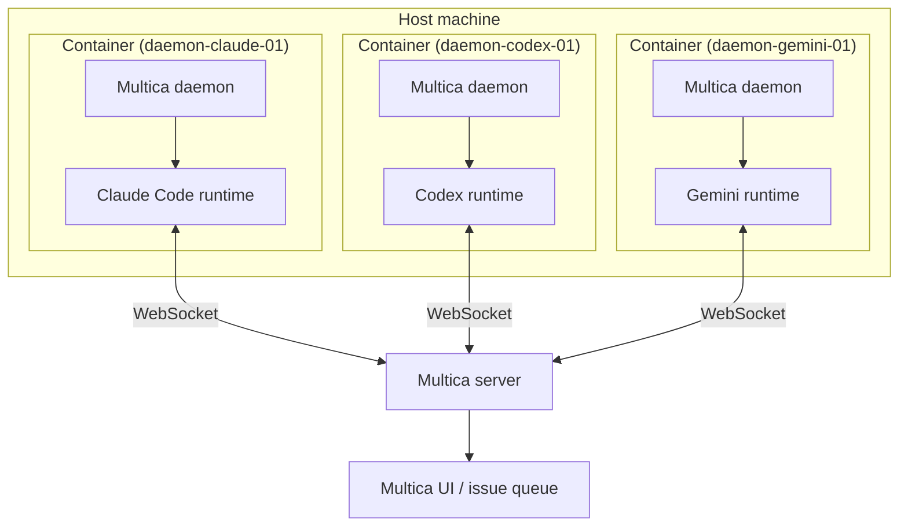

# Architecture

The Multica daemon images let one host run multiple daemon containers. Each image contains one AI coding CLI, so you scale by choosing which per-agent containers to start.



One host runs **N containers** with one `MULTICA_DAEMON_ID` per container. Each container provides the runtime for the CLI installed in that image.

## What's In The Box

Each image contains:

- **Node.js 24** on a Debian Trixie slim base, with Python added for Hermes.
- **The Multica CLI / daemon**, installed from the official release tarball for the target architecture.
- **AI coding agent CLIs** with exact `*_VERSION` build args in the relevant Dockerfile where upstream packages support pinned installs:
  - `@anthropic-ai/claude-code` - Claude Code
  - `@openai/codex` - Codex
  - `@github/copilot` - GitHub Copilot CLI
  - `@google/gemini-cli` - Gemini
  - `opencode-ai` - OpenCode
  - `@earendil-works/pi-coding-agent` - Pi
  - `hermes-agent` - Hermes
- **Dedicated per-agent variants**, built from `docker/Dockerfile.<variant>` files.
- **An entrypoint** ([`docker/docker-entrypoint.sh`](../docker/docker-entrypoint.sh)) that:
  1. Configures the daemon (`server_url`, `app_url`, `device_name`).
  2. Logs in with `MULTICA_TOKEN`.
  3. Starts `multica daemon start --foreground` as PID 1.

Containers run as a non-root `multica` user with `HOME=/multica` and a workspace root at `/workspaces`. Override the workspace root with `MULTICA_WORKSPACES_ROOT`.

## How Runtimes Scale

A single host can run any number of daemon containers simultaneously. Each container registers its own runtime with the Multica server.

```text
1 host
|-- N containers  (one MULTICA_DAEMON_ID each, e.g. daemon-01 ... daemon-N)
    |-- 1 agent CLI per container
        |-- Total = N runtimes visible in the Multica UI
```

Example: one Claude container, one Codex container, and one Gemini container on the same host = **3 runtimes**.

Practical scaling guidelines:

- **Scale containers** (`N`) when you want more parallel capacity. Each container handles tasks independently.
- **Scale using variants** when you need specific CLIs per container, such as running only the `claude` profile to dedicate hardware to Claude Code tasks.
- **`MULTICA_DAEMON_MAX_CONCURRENT_TASKS`** caps how many tasks one daemon runs at once. The default is `20`; lower it if your host is CPU or memory constrained.
- **Do not** run two containers with the same `MULTICA_DAEMON_ID`; the server will see conflicting heartbeats and reclaim tasks unpredictably.
