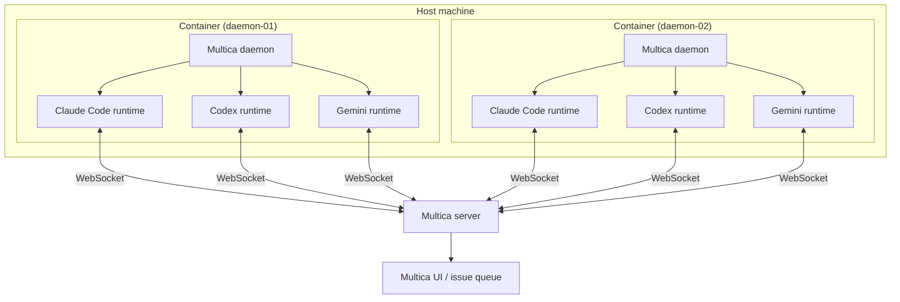

# Architecture

The Multica daemon image lets one host run multiple daemon containers. Each container can expose multiple runtimes, one for each installed AI coding CLI and connected workspace.



One host runs **N containers** with one `MULTICA_DAEMON_ID` per container. Each container runs **M runtimes**, one per installed CLI and workspace. Total runtimes on that host: **N x M**.

## What's In The Box

Each image contains:

- **Node.js 24** on a Debian Trixie slim base, needed by most CLIs distributed as npm packages.
- **The Multica CLI / daemon**, installed from the official `install.sh`.
- **Pinned versions of AI coding agent CLIs**, with exact `*_VERSION` build args in [`Dockerfile`](../Dockerfile):
  - `@anthropic-ai/claude-code` - Claude Code
  - `@openai/codex` - Codex
  - `@github/copilot` - GitHub Copilot CLI
  - `@google/gemini-cli` - Gemini
  - `opencode-ai` - OpenCode
  - `@earendil-works/pi-coding-agent` - Pi
- **An entrypoint** ([`src/docker-entrypoint.sh`](../src/docker-entrypoint.sh)) that:
  1. Configures the daemon (`server_url`, `app_url`, `device_name`).
  2. Logs in with `MULTICA_TOKEN`.
  3. Starts `multica daemon start --foreground` as PID 1.

The container runs as a non-root `multica` user with `HOME=/multica` and a workspace root at `/workspaces`. Override the workspace root with `MULTICA_WORKSPACES_ROOT`.

## How Runtimes Scale

A single host can run any number of daemon containers simultaneously. Each container registers its own set of runtimes with the Multica server.

```text
1 host
|-- N containers  (one MULTICA_DAEMON_ID each, e.g. daemon-01 ... daemon-N)
    |-- M runtimes per container  (one per installed CLI x workspace)
        |-- Total = N x M runtimes visible in the Multica UI
```

Example: three containers on one server, each with the all-in-one image with 6 CLIs, connected to 1 workspace = **3 x 6 x 1 = 18 runtimes**.

Practical scaling guidelines:

- **Scale containers** (`N`) when you want more parallel capacity for the same set of CLIs. Each container handles tasks independently.
- **Scale using variants** (`M`) when you need specific CLIs per container, such as running only the `claude` variant to dedicate hardware to Claude Code tasks.
- **`MULTICA_DAEMON_MAX_CONCURRENT_TASKS`** caps how many tasks one daemon runs at once. The default is `20`; lower it if your host is CPU or memory constrained.
- **Do not** run two containers with the same `MULTICA_DAEMON_ID`; the server will see conflicting heartbeats and reclaim tasks unpredictably.
